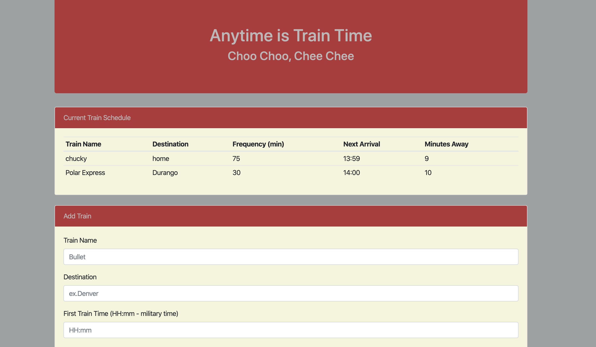

# TrainTime

Welcome to Train Time app!
Description: This website asks for a train name, destination, first train arrival, and frequencey and displays the results in a train table. The results show the next arrival time and how many minutes away the train is.
This a simple application built with HTML, CSS, JS and Moment.JS to track train arrival time.

Getting Started
to install locally run this command in your terminal
git clone https://github.com/tcary/TrainTime.git

once inside the Train-Scheduler folder, open the index.html in your preferred web browser.

Authors

Tetiana Cary
